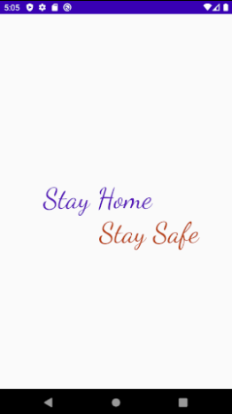
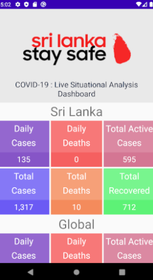

# COVID-19 : Live Situational Analysis Dashboard

This app was written using Android Studio with java.  It uses an API to update data which provided by the Health Promotion Bureau of Sri Lanka.  

# **Screenshots**

&nbsp;&nbsp;&nbsp;&nbsp;&nbsp;&nbsp;&nbsp;&nbsp;&nbsp;&nbsp;&nbsp;

# LICENSE
MIT license. See the LICENSE.md file.
